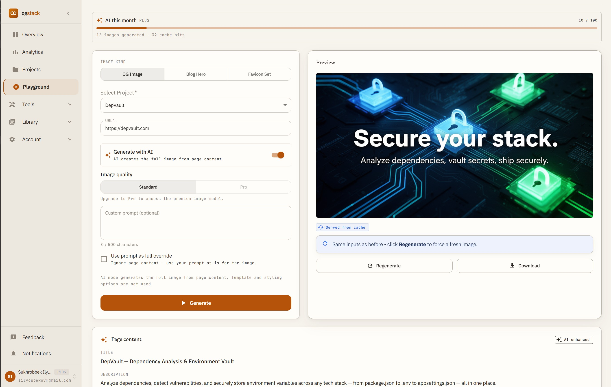
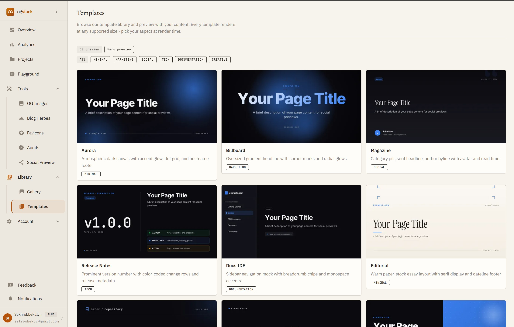
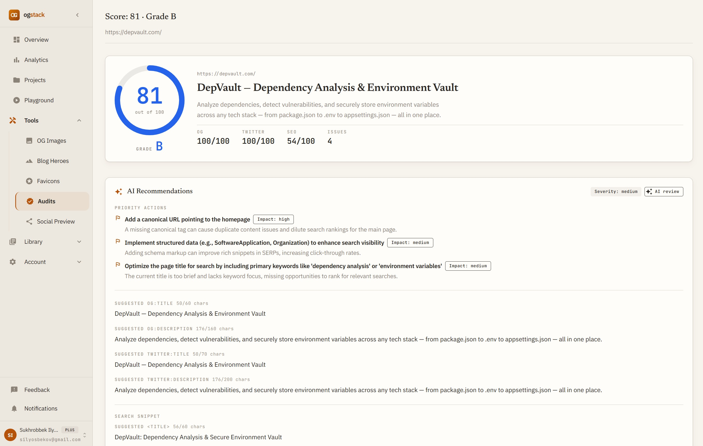
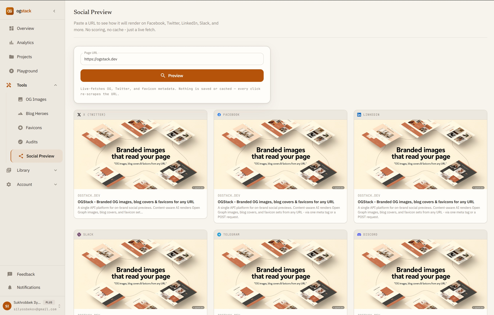
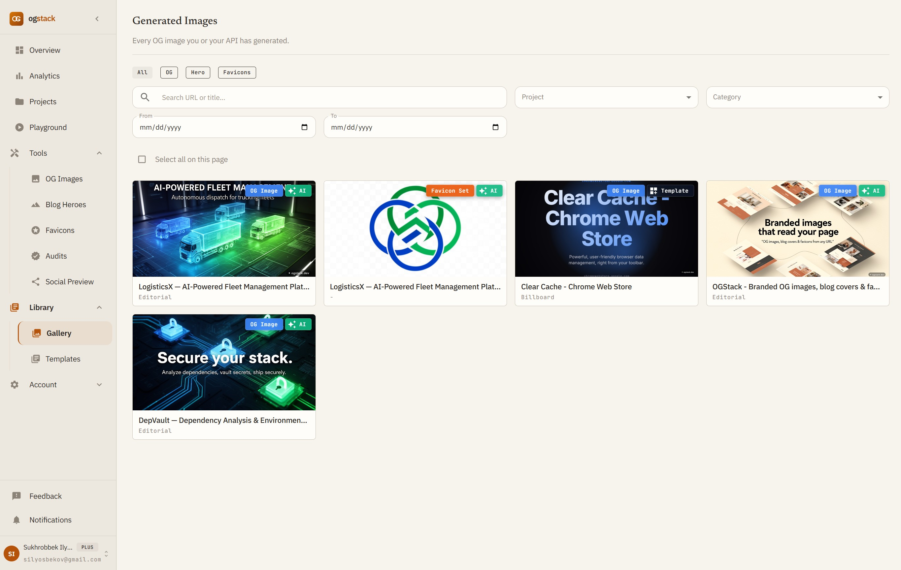
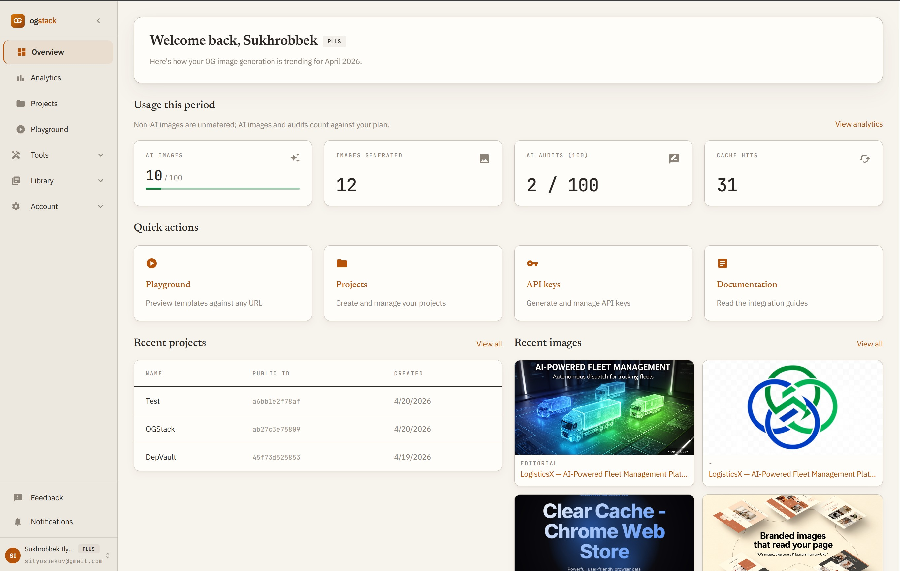

# OGStack: automatic Open Graph images, blog covers, and favicons from any URL

Tired of hand-designing Open Graph images for every new page, or shipping them with generic defaults that look nothing like your site?

I built OGStack for that.

OGStack generates Open Graph images, blog heroes, and full favicon sets from any URL. Every render starts by scraping the page. Templates turn the title, description, and favicon-derived accent into a deterministic image in under a second. AI mode analyzes the page content first and uses it to ground the generated image, so a changelog post gets an image built for that changelog, not a generic astronaut.

Set it up once and every page you publish gets a preview that actually looks like your site.

---

## Try it in the playground

Paste a URL, pick a kind (OG image, blog hero, or favicon set), toggle AI on or off, hit generate. The image comes back in a few seconds. A side panel shows the page content the scraper pulled, so you can see what the AI was looking at.



Performance is one of the main reasons OGStack exists. Once you generate an image against one of your projects, it sticks around indefinitely and serves from the CDN in under 100ms globally, with a cache hit ratio well north of 90% in practice. A page you wire up today will still be serving the same image a year from now unless you hit regenerate.

The anonymous playground is a bit different: renders there get cleaned up after 24 hours unless you attach them to a project. Once you create a project (free tier is fine), everything you generate stays put.

---

## Templates you don't have to design

You don't need a designer. Pick a template: Aurora if you want something dark and atmospheric, Magazine for editorial posts, Release Notes for changelog entries, Docs IDE for API reference pages. Every template renders at any supported size.



Pick one per project and every image on your site stays consistent. No re-exporting PNGs from Figma, no arguing about padding in Slack.

I'm adding more templates regularly, and each one is getting new parameters like accent color overrides, logo placement, and typography controls. Custom templates are next. You'll be able to upload your own component and render it through the same pipeline.

---

## The OG Audit

You don't need an account to try it. Paste a URL on [ogstack.dev/audit](https://ogstack.dev/audit) and you get a 0–100 score with a letter grade, separate scores for OG, Twitter, and SEO meta, a prioritized list of what's wrong, and AI recommendations that rewrite your titles and descriptions and suggest structured data tuned to the page.



Most sites have room to improve on a first audit. The fixes are usually small: a missing canonical tag, a truncated OG description, a Twitter card nobody added. Every one of those costs you click-through every time a link gets shared.

---

## Social preview for every platform

Facebook's debugger caches responses and invalidates on its own schedule, and X quietly retired its card validator a couple of years ago without a proper replacement. Social Preview skips all of that. It fetches your URL live and renders it the way each platform actually shows it today: X, Facebook, Instagram, LinkedIn, Slack, Telegram, Discord, and VK.



Paste the URL after you push a change and you see every version at once. Run it before a launch post or a newsletter, or any time you're editing meta tags.

---

## Your image library

Everything you generate ends up in the library, tagged and searchable. Filter by kind, project, date, or template. Anything AI-generated carries an AI chip so you can see at a glance which images are spending your quota.



Select a batch to re-download, regenerate, or delete. Every image has a stable URL, so embedding one in a CMS works the same whether it came from the playground, the API, or a meta tag.

---

## The dashboard

The home screen puts your projects, API keys, usage numbers, analytics, and recent images on one page. The usage row makes the main thing clear: non-AI images don't count against your plan. Only AI renders and AI audits do.



One click from there and you're in the playground, the projects page, your API keys, or the docs.

---

## Two ways to plug it in

Once your project is set up, there are two ways to actually wire OGStack into your site.

You can drop a single `<meta>` tag into your `<head>` using a public project ID. A template-based OG image looks like this:

```html
<meta
  property="og:image"
  content="https://api.ogstack.dev/og/pk_abc123?url=https://my-site.com/post&template=editorial"
/>
```

Switch on AI by adding `ai=true` (and optionally `aiModel=pro` for the higher-quality model):

```html
<meta
  property="og:image"
  content="https://api.ogstack.dev/og/pk_abc123?url=https://my-site.com/post&ai=true&aiModel=pro"
/>
```

No API key, no code change beyond the tag. Good enough for static sites, marketing pages, and most blogs.

Or call `POST https://api.ogstack.dev/images/generate` with a Bearer token when you want server-side control: custom overrides per post, programmatic icon set generation, or cache invalidation on demand.

```bash
curl -X POST https://api.ogstack.dev/images/generate \
  -H "Authorization: Bearer og_live_abc123..." \
  -H "Content-Type: application/json" \
  -d '{
    "projectId": "01JA0K4T8RZ...",
    "url": "https://my-site.com/blog/launching-v2",
    "kind": "og",
    "ai": { "model": "pro" },
    "style": { "accent": "#10b981" }
  }'
```

You can swap `"ai": { "model": "pro" }` for `"template": "editorial"` when you want a template-rendered image instead, or drop both for the project's default template. `kind` accepts `og`, `blog_hero`, or `icon_set` - icon sets come back with an `assets` array of every size and format.

---

## Start here

You can get started for free. The audit takes ten seconds and doesn't need an account at [ogstack.dev/audit](https://ogstack.dev/audit). The playground is at [ogstack.dev/playground](https://ogstack.dev/playground), and a free project gets you unlimited non-AI OG and blog hero images plus three AI renders per month to try the interesting stuff.
